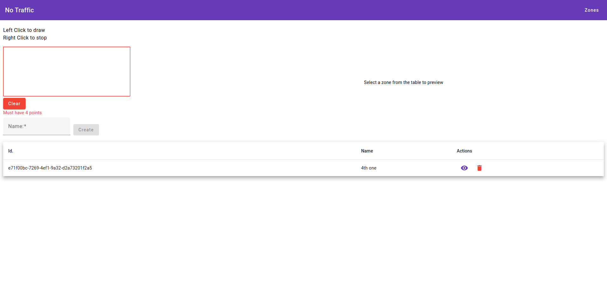

# No Traffic Frontend

This project was generated with [Angular CLI](https://github.com/angular/angular-cli) version 16.1.6.

## Installation
```bash
$ npm i
```
## Start
```bash
$ npm run start
```
Navigate to `http://localhost:4200/`

## Build

Run `ng build` to build the project. The build artifacts will be stored in the `dist/` directory.

## Demo ([Click](./demo.mp4) for Video)
[](./demo.mp4)
